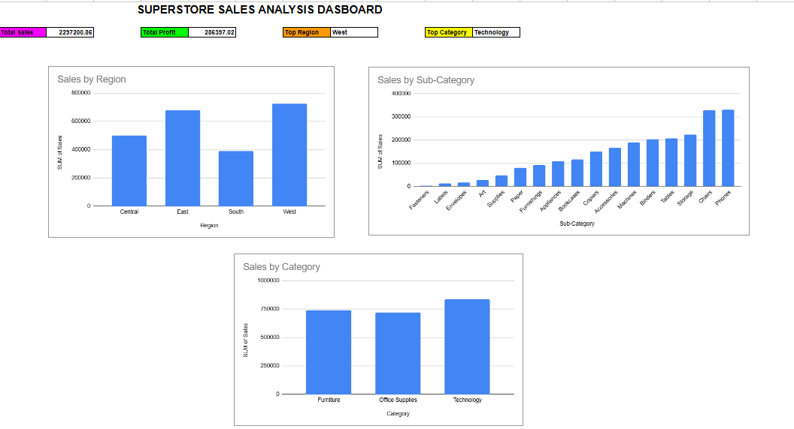

# Superstore Sales Analysis Dashboard

## Project Overview
This project analyzes Superstore sales data using Microsoft Excel.

## Dashboard KPIs
- Total Sales: 2,297,200.86
- Total Profit: 286,397.02
- Top Region: West
- Top Category: Technology

## Dashboard Components
1. Sales by Region
2. Sales by Sub-Category
3. Sales by Category
4. KPI Summary Cards

## Tools Used
- Microsoft Excel
- Pivot Tables
- Pivot Charts
- Dashboard Design

## Key Insights
- West region generated the highest sales.
- Technology is the top-performing category.
- Phones and Chairs are among the highest-selling sub-categories.

## Dashboard Screenshot

